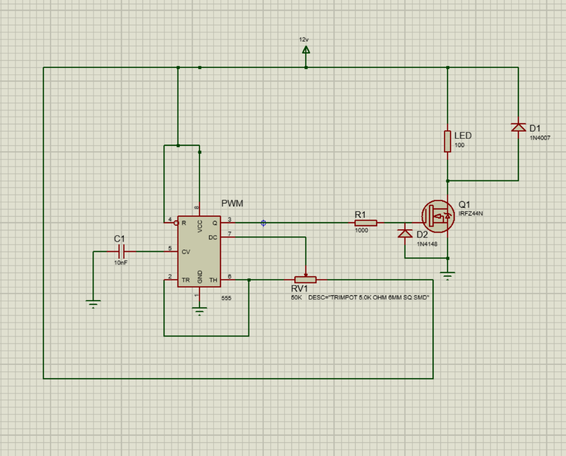

# MOSFET-Based LED Dimmer (555 PWM → IRFZ44N)

## Overview
This project implements an LED dimmer using Pulse-Width Modulation (PWM) generated by a 555 timer. The PWM drives an N-channel MOSFET (IRFZ44N) which switches the LED load. Adjusting the potentiometer changes the PWM duty cycle and therefore the perceived brightness of the LED.

## Components
- **555 Timer IC** (configured to produce PWM using separate charge/discharge paths)  
- **IRFZ44N** N-channel MOSFET (gate driven by PWM)  
- **Potentiometer** (50 kΩ - variable duty cycle)  
- **1 kΩ gate resistor** (R1)  
- **1N4148** (timing diode)  
- **1N4007** (flyback / transient protection)  
- **Timing / decoupling capacitor (C1)**  
- **LED** (load)

## Detailed Working

### PWM generation (555 timer)
The 555 is configured such that the capacitor charges through one resistor path and discharges through another; often a diode is used to separate the charge and discharge paths so that the duty cycle can be varied independently of frequency.  
A commonly used formula for duty cycle (from the report) is:

\[
D = \frac{R_A + R_B}{R_A + 2R_B} \times 100\%
\]

Example values in the design: RA = 1 kΩ, RB = 50 kΩ (potentiometer). Vary RB to sweep duty cycle.

### Gate drive and MOSFET switching
- The PWM output from the 555 is fed to the MOSFET gate through R1 (1 kΩ). The gate resistor reduces ringing and limits gate-charge inrush current.
- When PWM is HIGH, the MOSFET turns ON and current flows through the LED; when LOW, it turns OFF.
- For best efficiency at a 5V gate drive, use a logic-level MOSFET (IRL-series) or ensure the IRFZ44N achieves acceptable Rds(on) at the available Vgs.

### Protection and stability
- **Flyback diode (1N4007):** protects against switching transients (important if wiring/inductance present).
- **1N4148 diode:** used in timing network to create independent charge/discharge paths for adjustable duty cycle.
- **Decoupling capacitor (C1):** stabilizes the 555 timing and filters supply noise.
- Choose PWM frequency high enough (> ~200 Hz; 1–5 kHz recommended) to avoid visible flicker.

### Practical notes & improvements
- Prefer logic-level MOSFETs (e.g., IRLZ44N) for reliable low-voltage gate drive.
- Add a heatsink for the MOSFET when driving high currents.
- Add an RC snubber across MOSFET or load if switching spikes are present.
- For more precise control, replace 555 with a microcontroller PWM output (for closed-loop brightness control or higher frequency).

## Files in this repository
- `README.md` — this file (detailed working + circuit image)  
- `images/circuit_diagram.png` — circuit screenshot you provided  
- `LICENSE` — MIT license

## Author
**Sreyas Kishore T** — College of Engineering Trivandrum, KTU ID: TVE22AE062

## License
This project is licensed under the MIT License. See `LICENSE`.
